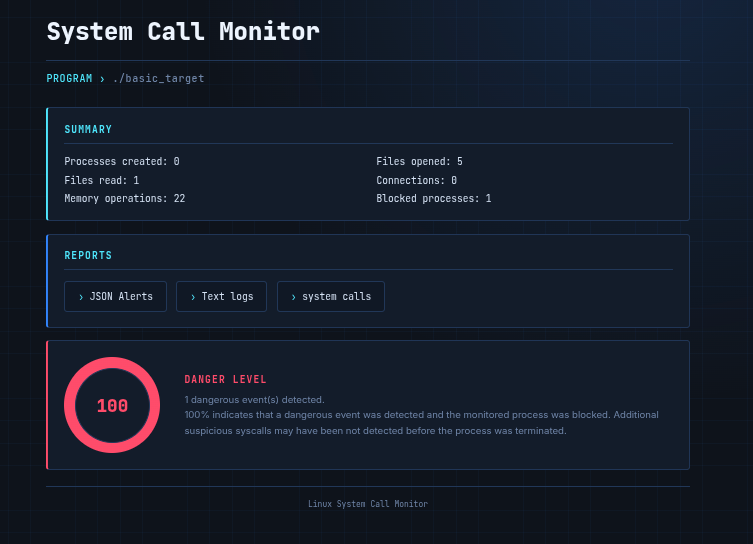

# SysTace

A lightweight Linux system call monitor written in C using `ptrace`. It traces a target process, logs its syscall activity, flags suspicious behavior with a rule-based engine, and includes a small ML component that classifies syscall behavior as benign or malicious.

Runtime output goes to `log.txt`, with high-severity alerts saved separately to `alerts.json`.

This is a work in progress — features and internals are still changing.

# Project Status

> **Development Status:** 🟡 On Hold

Development of this project is currently paused.

I am not actively working on this project at the moment, but I plan to return to it in the future and continue its development, improvements, and maintenance.

The project is therefore **not abandoned** — development is simply on hold for now.

I will update this README when active development resumes.

## Features

- Process tracing via `ptrace`
- File, process, memory, and network activity monitoring
- Syscall statistics collection
- HTML report generation
- Rule-based detection with alert logging
- Process termination (`SIGKILL`) on critical events
- ML-based behavioral classification (Random Forest)

## Monitored Syscalls

| Category | Syscalls |
|---|---|
| File | `open`, `openat`, `read`, `write`, `close` |
| Process | `fork`, `clone`, `execve`, `wait4` |
| Memory | `mmap`, `mprotect`, `munmap` |
| Network | `socket`, `bind`, `listen`, `accept`, `connect`, `send`, `recv` |

## HTML Report

Running the monitor produces an HTML dashboard summarizing what it saw during execution.



## Machine Learning Detection

The C monitor collects raw syscall counts and writes them out as a feature vector (`features.json`), which a separate Python script feeds into a trained Random Forest model for a benign/malicious prediction.

```
target program → ptrace monitor → syscall stats → features.json → ML model → benign/malicious
```

**Features (fixed order, used both for training and inference):**

```python
["file", "process", "network", "fork", "connect", "execve",
 "read", "open", "close", "memory", "chmod", "killit"]
```

Example `features.json`:

```json
{
  "file": 50, "process": 1, "network": 0, "fork": 0,
  "connect": 0, "execve": 0, "read": 7, "open": 46,
  "close": 46, "memory": 5, "chmod": 8, "killit": 0
}
```

**Model:** `RandomForestClassifier(n_estimators=200, class_weight="balanced", random_state=42)`, trained on `dataset.csv`, stored at `ml/syscall_model.pkl`.

```
ml/
├── train.py
├── predict.py
└── syscall_model.pkl
```

`predict.py` loads `features.json` and the saved model, and returns a classification the reporting system can use.

### Limitations

The ML layer is a supplementary signal, not a verdict. It's sensitive to dataset size and quality, class imbalance, train/test leakage, and how closely the test programs match real-world software and environments. Don't treat a program as malicious or benign purely on the model's output — the rule-based engine and raw syscall log are still the primary source of truth.

## Build & Run

```bash
make          # build monitor, sample target, and test programs
make run      # build + trace the sample target + run ML prediction + generate report
make clean    # remove build artifacts
make re       # clean rebuild
```

To monitor your own program instead of the bundled sample, edit the target in the `Makefile`:

```make
TARGET = src/my_program.c
```

then `make clean && make && make run`.

## Generated Files

| File | Contents |
|---|---|
| `features.json` | Syscall stats fed to the ML detector |
| `report.html` | Generated security report |
| `alerts.json` | High-severity alerts from the rule engine |
| `log.txt` | General monitoring log |
| `syscall.txt` | Raw ptrace syscall trace |

These are runtime output and shouldn't be committed.

## Project Structure

```
.
├── dashboard/          # HTML report generation
├── include/             # headers
├── ml/                  # training + inference scripts, saved model
├── src/                 # tracer, monitors, rule engine
├── tests/               # benign/malicious sample programs
├── dataset.csv
└── Makefile
```

## Dataset

`dataset.csv` holds labeled syscall statistics used to train the model:

```
program,file,process,network,fork,connect,execve,read,open,close,memory,chmod,killit,label
malicious_050,50,1,0,0,0,0,7,46,46,5,8,0,1
benign_004,0,0,3,0,3,0,1,0,1,0,0,0,0
```

`program` is just an identifier — it's not used as a training feature. `label` is `0` (benign) or `1` (malicious).

## Tests

```
tests/
├── benign_fileread.c
├── benign_idle.c
├── mal_connect.c
├── mal_fileopen.c
├── mal_forkbomb.c
└── mal_mmap_mprotect.c
```

These exercise the tracer, rule engine, and ML classifier against known-good and known-bad behavior. `mal_forkbomb.c` spawns a large number of processes — only run it in a VM or otherwise isolated environment.

## Roadmap

- [x] Core tracer, monitors, rule engine, alerting, dashboard, ML integration
- [ ] Better ML dataset and evaluation
- [ ] More syscall features
- [ ] More robust process tracing

## Disclaimer

For educational and research use only. Only run this against processes you own or have explicit permission to inspect. Some test programs are intentionally aggressive — run them in isolated environments. The author isn't responsible for misuse, data loss, instability, or legal issues arising from use of this software.

## License

MIT